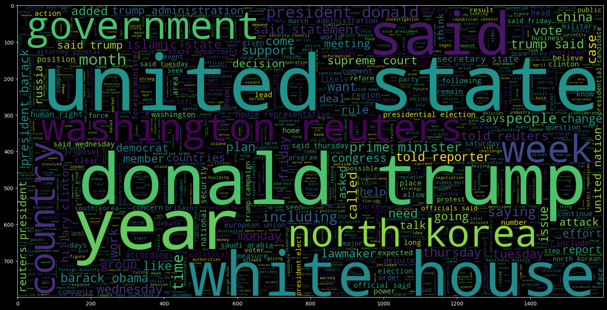
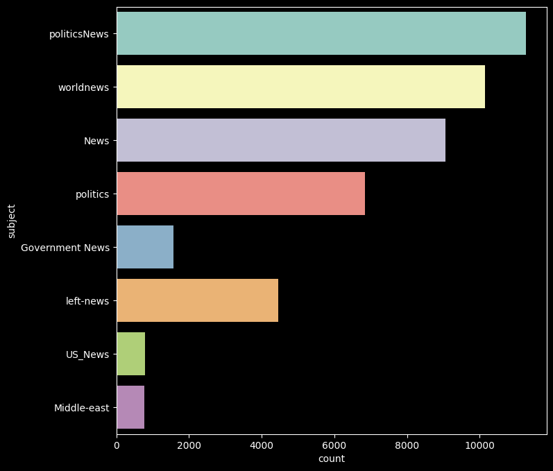
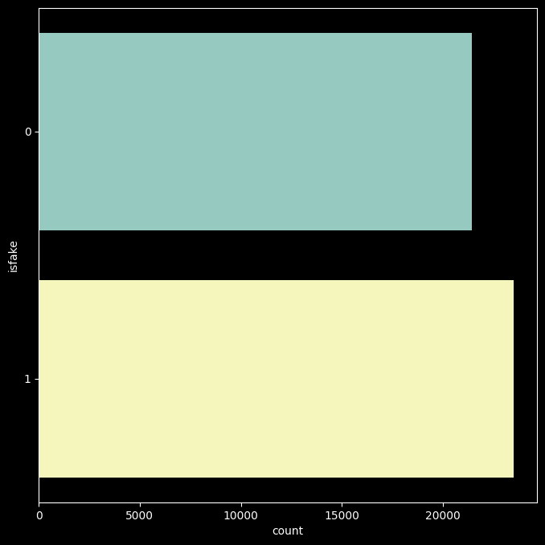

# NLP Fake News Detector



## Project Structure

The NLP Fake News Detector project is structured into the following tasks:

- Understand the Problem Statement and business case
- Import libraries and datasets
- Perform Exploratory Data Analysis
- Perform Data Cleaning
- Visualize the cleaned data
- Prepare the data by tokenizing and padding
- Understand the theory and intuition behind Recurrent Neural Networks and LSTM
- Build and train the model
- Assess trained model performance

## Introduction

In today's world, the proliferation of misinformation and fake news poses a significant challenge. The aim of this practical project is to combat this issue by developing a fake news detection system based on Recurrent Neural Networks (RNNs).

Natural Language Processing (NLP) serves as the foundation of this endeavor, operating by transforming textual information into numerical representations. These numerical embeddings are then utilized to train sophisticated Artificial Intelligence/Machine Learning (AI/ML) models capable of discerning the authenticity of news articles.

The deployment of AI/ML-powered fake news detection holds immense value for both companies and media outlets, offering an automated solution to assess the veracity of circulating news stories swiftly and accurately.

Throughout this case study, we will delve into the analysis of thousands of news articles, employing advanced NLP techniques to classify them as either genuine or fake. By leveraging the power of Recurrent Neural Networks, we endeavor to contribute to the ongoing efforts in combating the spread of misinformation and promoting information integrity.

- Model Accuracy :  0.9938752783964365

#  IMPORT LIBRARIES AND DATASETS

```python
# Import necessary libraries and datasets
import pandas as pd
import numpy as np
import matplotlib.pyplot as plt
import seaborn as sns
import nltk
import re
from nltk.stem import PorterStemmer, WordNetLemmatizer
from nltk.corpus import stopwords
from nltk.tokenize import word_tokenize, sent_tokenize
import gensim
from gensim.utils import simple_preprocess
from gensim.parsing.preprocessing import STOPWORDS
from tensorflow.keras.preprocessing.text import one_hot, Tokenizer
from tensorflow.keras.preprocessing.sequence import pad_sequences
from tensorflow.keras.models import Sequential
from tensorflow.keras.layers import Dense, Flatten, Embedding, Input, LSTM, Conv1D, MaxPool1D, Bidirectional
```

## Perform Exploratory Data Analysis

```python
# Perform exploratory data analysis
...
```

## Perform Data Cleaning

```python
# Perform data cleaning
...
```

## Visualize Cleaned up Dataset

```python
# Visualize the cleaned up dataset
...
```






## Prepare the Data by Performing Tokenization and Padding

```python
# Prepare the data by performing tokenization and padding
...
```

## Build and Train the Model

```python
# Build and train the model
...
```

## Assess Trained Model Performance

```python
# Assess trained model performance
...
```


Model Accuracy :  0.9938752783964365

This project entails the development of a sophisticated fake news detection system using Natural Language Processing and Recurrent Neural Networks. It encompasses various stages, including data exploration, cleaning, modeling, and performance evaluation. Through this endeavor, we aim to contribute to the ongoing efforts to combat the proliferation of misinformation in the digital age.

```
